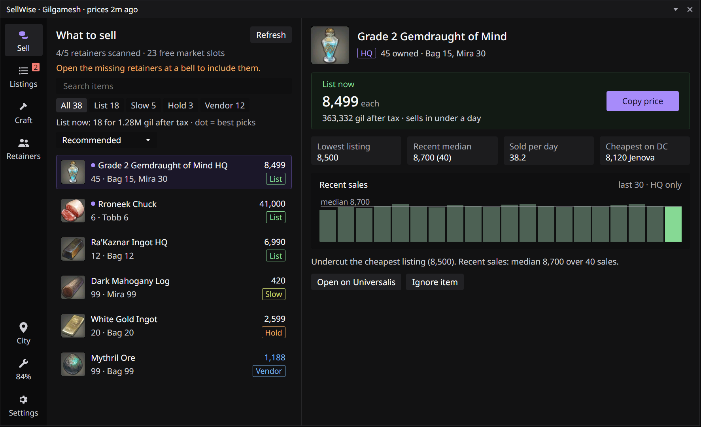
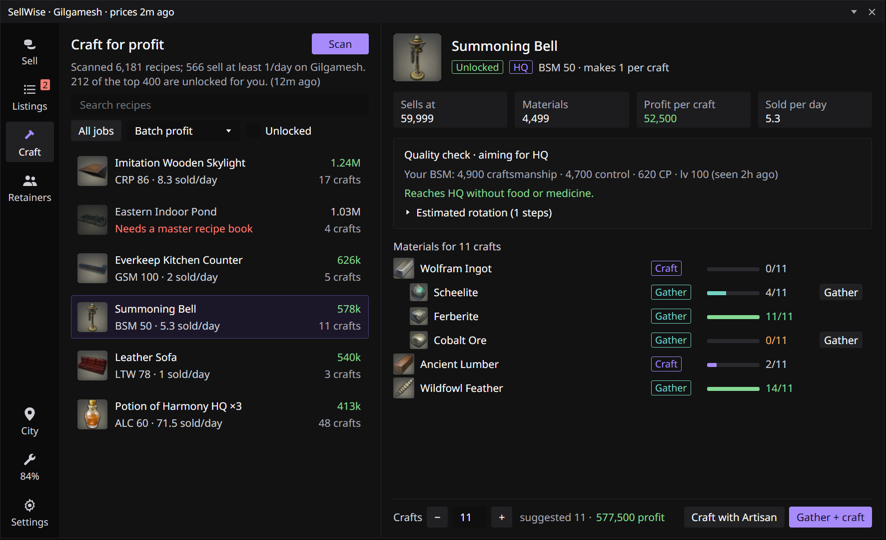
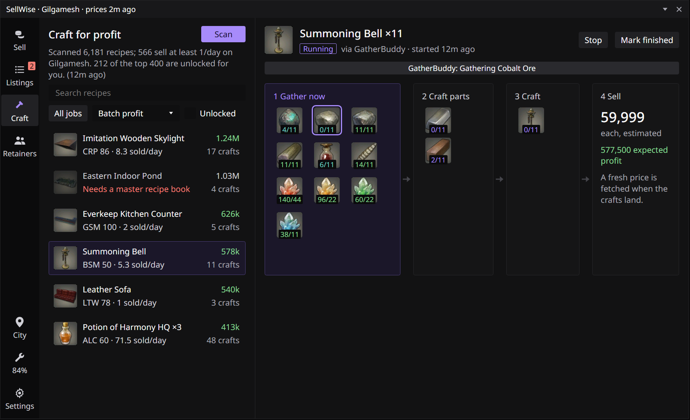

<p align="center">
  
</p>

<h1 align="center">SellWise</h1>

<p align="center">
  <b>Know what to sell, where, and for how much.</b><br>
  A market, crafting and retainer helper for FINAL FANTASY XIV, built on Dalamud.
</p>

<p align="center">
  <a href="#installing">Install</a> ·
  <a href="#what-to-sell">Selling</a> ·
  <a href="#craft-for-profit">Crafting</a> ·
  <a href="#dependencies">Dependencies</a>
</p>

---

Ever stared at a full inventory and a stack of retainers and wondered what's actually worth anything? That's what SellWise is for.

It looks through your bags, your chocobo saddlebag and your retainers, checks live prices on [Universalis](https://universalis.app), and tells you what to put on the market board, what to sell to a vendor, and what to sit on for now. When you want to make gil rather than just clear space, it finds the crafts worth making on your world and can hand the gathering and crafting off to GatherBuddy Reborn or Artisan.

It won't touch the market board for you. It tells you the price; you do the listing.

<sub>The screenshots are renders of SellWise's screens, drawn from its UI code with real item icons. In game, fonts and spacing follow your Dalamud settings.</sub>

## What to sell



Everything you own shows up in one list, with a suggestion for each item:

- **List:** it'll sell. Undercut the cheapest listing at the price shown (there's a Copy button).
- **Slow:** worth listing, but don't expect it to move quickly. Good for a spare slot.
- **Hold:** someone's dumped it way below what it normally sells for. Wait it out, or list just behind them.
- **Vendor:** an NPC pays about as much as the market would. Not worth a retainer slot.

Click an item and you'll see what it's been selling for, how many sell a day, the cheapest one on your data center, and a quick chart of recent sales. Items marked with a dot are the best use of your free retainer slots.

A few things it does so you don't get burned:
- It judges prices by the **median** of recent sales, so one weird sale doesn't throw everything off.
- It ignores your own retainers when looking for who to undercut.
- If someone dumps an item for a fraction of its worth, it won't tell you to chase them to the bottom.
- HQ and NQ are priced separately, since a cheap HQ listing steals NQ buyers too.

You can tweak the undercut amount, tax rate and the rest in Settings.

## My listings

This screen keeps an eye on what your retainers already have up. If someone undercuts you, it tells you the new price to use. If you've priced something way too low, it tells you that too. A little `SellWise: 2 undercut` note shows up in the server info bar so you know without opening anything.

## Craft for profit



Hit **Scan** and SellWise prices every recipe that sells on your world. It takes about a minute the first time, then it's cached for half an hour. For each recipe it works out:

- **How you get the materials is up to you:** pick **Gather & craft** (gather everything and make every part, the way GatherBuddy does), **Cheapest mix** (buy wherever that beats making it), or **Buy everything** from the market board. Profit, material cost and time all follow what you pick. Click any material's tag to change just that one; the menu shows what each option costs per unit.
- **How much you'd actually make:** it ranks by what one batch earns, sized to what your world's market can take in a couple of days, so you don't end up undercutting yourself.
- **Whether you can make it:** locked recipes say why (level, a master recipe book, or a quest).
- **How long it'll take:** a rough gathering and crafting time, including waiting for timed nodes (the ones that only spawn at certain Eorzea hours) to come up.
- **Whether you'll hit HQ:** it uses your saved stats for that job and simulates the craft. If you'd fall short, it suggests the cheapest food and potion to get you there, and anything already in your bags counts as free. For scrip collectables it aims for the top reward tier.

### Letting it run



**Gather + craft** first checks what's already in your bags: materials you have, and parts you've already made (an ingot, some lumber), are used, and a part you hold takes its own materials off the list, so nothing is gathered or crafted twice. The materials list shows these as **In bags**. If anything still missing only drops from monsters, SellWise hunts it first (see below). Then GatherBuddy Reborn gathers the rest (it only takes from retainers if its retainer restock is on, so withdraw anything you want used). If you have Artisan too, SellWise takes the crafting from there: once GatherBuddy has everything, SellWise stops it (never in the middle of a craft) and has Artisan make the parts and the item, pushing quality as high as it'll go. Without Artisan, GatherBuddy does the crafting itself. If you've already got the materials, **Craft with Artisan** skips straight to crafting. If you planned to buy something, SellWise lists what to pick up first. It never buys for you, so anything that isn't in your bags when the job starts, GatherBuddy gathers or crafts instead.

When it's done, SellWise pulls a fresh price so you know what to list at.

Once you press start, the main window tucks itself away and a small **SellWise progress** window takes over. It comes back by itself when the job's done (or if it fails), or whenever you click **Open SellWise**. While it's gathering, the progress window lists every material with a meter that fills as it lands in your bags, how long each will take (or when a timed node next spawns), and your GP. Once everything's gathered it switches to a crafting meter with time left, and when it's finished it shows the price to list at. Tick **Use cordials when ready** there and SellWise drinks the biggest cordial that won't waste GP whenever the cooldown's up, between nodes.

### Any recipe

The **Any recipe** tab is for just making something: search any recipe (sellable or not), set how many, and go.

- **Gather + craft:** anything monster-only is hunted first, GatherBuddy gathers the rest, then Artisan crafts the parts and the item. What's already in your bags is used.
- **Gather only:** GatherBuddy gathers everything the recipe needs and stops there, so you can craft it yourself later.
- **Craft with Artisan:** when the materials are already in your bags.

It uses the same material choices, HQ check and time estimate as Craft for profit.

### Job quests

The Craft section's third tab, **Job quests**, is for crafter and gatherer quests that need items handed in.

- **Where you stand:** every quest shows whether it's in your journal, ready to pick up, locked (and why: the level you need or the quest to finish first) or done. By default it lists the ones you can do now.
- **What to hand in:** each item, how many, and whether it has to be high quality, with how many you already have. The game data says which items a quest takes but not how many, so SellWise reads the count from the quest's journal text; where the text doesn't say, it shows "?" and you set the number. Special materials the quest hands you are marked as such.
- **Making it:** **Make** crafts one item, **Make all** does everything the quest still needs, and **Make everything** at the top does it for every quest you can do now. With more than one item, SellWise gathers (and hunts) for all of them first and doesn't craft anything until every item's materials are in your bags, then Artisan crafts them one after another. Materials two items share are topped up before crafting starts. Items you only gather have a **Gather** button that sends you to the node with GatherBuddy.
- **Crafting at the quest giver:** once the gathering's done, SellWise takes you to the quest giver before Artisan crafts, so you can hand the items straight in. It teleports to the zone's aetheryte, or for givers off the main aetheryte (Old Gridania, the Steps of Thal, the Upper Decks, the Pillars) teleports to the city and takes the aethernet with [Lifestream](https://github.com/NightmareXIV/Lifestream), then walks the rest with vnavmesh. Turn it off with "Craft next to the quest giver" on the quest.

### Hunting mob drops

Some materials only drop from monsters, like the Boar Hide and Diremite Web in a Wrapped Crowsbeak Hammer. **Gather + craft**, **Gather only**, **Make** and **Make everything** hunt those first on their own, then carry on with the gathering and crafting; if a hunt can't be done, nothing is started, so GatherBuddy isn't left stuck on a missing hide. You can also hunt one material by itself: wherever SellWise lists materials (Craft for profit, Any recipe, Scrips, Job quests), those get a **Hunt** button. Hover it to see which monsters drop the item and where; the drop data comes from [Garland Tools](https://www.garlandtools.org), since the game files don't include drop tables.

Press it and SellWise:
- picks the easiest open-world spot you can reach (an aetheryte you're attuned to, monsters no more than 3 levels above your best combat job),
- switches to your highest-level combat gearset,
- teleports and rides there (mounting for long trips),
- targets the nearest monster of that kind that nobody else is fighting and walks up to it, while [WrathCombo](https://github.com/PunishXIV/WrathCombo) or [RotationSolver Reborn](https://github.com/FFXIV-CombatReborn/RotationSolverReborn) does the fighting,
- stops once you have enough.

It stops and tells you why if you're defeated, the monsters are too high a level, or none turn up for three minutes. WrathCombo lends SellWise its auto-rotation for the hunt and puts your own settings back afterwards; with RotationSolver, SellWise switches it to Manual mode and back off.

## Scrips

The **Scrips** tab is for farming purple and orange crafters' scrips.

- **What to make:** every crafter collectable your job levels unlock, with the scrips its top tier pays, how many scrips an hour the crafting earns, and what the materials cost per scrip. SellWise simulates each craft with your saved stats and only lists the ones that reach the **top collectability tier**. If food or medicine would get you there, it says which.
- **Making them:** **Gather + craft** has GatherBuddy gather the materials and Artisan craft the collectables, just like Craft for profit. **Craft with Artisan** works when the materials are already in your bags. The quantity box shows how many crafts fit before you hit the scrip cap.
- **Turning in:** when the job's done (or whenever you press **Turn in**), SellWise teleports to Solution Nine or Radz-at-Han, walks to the collectable appraiser and turns in every crafter collectable in your bags. If the next one would take you over the scrip cap, it stops and tells you to spend some first.
- **The scrip exchange:** a checklist of everything the purple and orange exchanges sell. Mounts, minions, orchestrion rolls and other unlocks show whether you've unlocked them. Gear and furniture show whether you have them anywhere (bags, armoury, retainers, glamour dresser, armoire). Materia and materials show how many you hold, how many you've bought (SellWise counts your purchases while the exchange is open), and what they're worth in gil per scrip on the market board.
- **Goals:** tick what you're saving for and SellWise tells you how many more scrips that takes, and roughly how many crafts of your best collectable.

SellWise doesn't buy anything at the scrip exchange. You do the buying; it keeps track.

## The little extras

- **Repairs:** before a craft job starts (and between Artisan steps), SellWise checks your gear. If it's getting low, it repairs with Dark Matter if you can, or pops over to a city with a mender and gets it done there.
- **City teleport:** one click sends you to a random major city you've unlocked. You pick which ones count in Settings.
- **Retainers:** the game only lets plugins see a retainer's items while you're talking to them, so open each retainer once at a summoning bell. SellWise remembers what it saw after that.

## Commands

| Command | What it does |
|---|---|
| `/sw` | Open SellWise (`/sellwise` works too) |
| `/sw craft` | Jump to Craft for profit |
| `/sw recipe` | Jump to Any recipe |
| `/sw quests` | Jump to Job quests |
| `/sw scrips` | Jump to Scrips |
| `/sw turnin` | Take your crafter collectables to an appraiser and turn them in |
| `/sw refresh` | Refresh prices |
| `/sw repair` | Repair your gear now |
| `/sw city` | Teleport to a random major city |
| `/sw bell` | Walk to the nearest summoning bell (needs vnavmesh) |
| `/sw stop` | Stop whatever SellWise is doing |
| `/sw config` | Open Settings |

## Installing

1. In game, open `/xlsettings`, go to **Experimental**, and add this under **Custom Plugin Repositories**:
   ```
   https://raw.githubusercontent.com/V1B3Gaming/SellWise/main/repo.json
   ```
   Tick **Enabled**, click **+**, then **Save and Close**.
2. Open `/xlplugins`, search for **SellWise**, and install it. Updates come through automatically.

## Dependencies

**You need**
- [Dalamud](https://github.com/goatcorp/Dalamud) (API 15, through XIVLauncher)
- An internet connection for [Universalis](https://universalis.app) prices. No account needed. Prices are only as fresh as the last time someone checked that item's market board.

**Comes bundled**
- [ECommons](https://github.com/NightmareXIV/ECommons), which handles clicking through the repair and confirmation windows. It's installed with SellWise; you don't need to do anything.

**Nice to have** (SellWise works without these; the buttons that need them just stay greyed out)
- [vnavmesh](https://github.com/awgil/ffxiv_navmesh): walking to summoning bells, menders, collectable appraisers and quest givers
- [GatherBuddy Reborn](https://github.com/FFXIV-CombatReborn/GatherBuddyReborn): Gather + craft, the per-material Gather buttons, and potions/food while gathering (turned on in its own settings)
- [Lifestream](https://github.com/NightmareXIV/Lifestream): the aethernet hop to job quest givers in Old Gridania, the Steps of Thal, the Upper Decks and the Pillars
- [Artisan](https://github.com/PunishXIV/Artisan): Craft with Artisan
- [WrathCombo](https://github.com/PunishXIV/WrathCombo) or [RotationSolver Reborn](https://github.com/FFXIV-CombatReborn/RotationSolverReborn): the fighting when you hunt mob drops (SellWise never fights on its own)

**Building it yourself**
- .NET 10 SDK and Dalamud.NET.Sdk 15.0.0, which uses the Dalamud files XIVLauncher installs. Tests use xUnit.
```
dotnet build SellWise/SellWise.csproj -c Release
dotnet test SellWise.Tests
```

## Worth knowing

- SellWise only **suggests** prices. It never lists, buys or reprices anything on the market board, and it never buys from the scrip exchange.
- The gathering and crafting are done by GatherBuddy Reborn and Artisan, so the same rules apply as when you use them on their own: stay at your keyboard.
- The HQ check assumes normal-quality materials and no lucky conditions, so real crafts should do at least as well.
- Letting Artisan do the crafting is on by default (Settings, "Let Artisan do the crafting after GatherBuddy gathers"). GatherBuddy has no plugin interface for stopping its queue, so SellWise uses its `/gatherdebug repairstop` command, which calls the same stop as its own Stop button; you'll see a debug line in chat when it does.
- If you turn that off, set GatherBuddy's crafter to **Standard Solver** for max quality (`/vulcan`, Settings, Solver Mode). On Pure Raphael, GatherBuddy only plans for normal-quality materials, so crafts that use the HQ parts it just made get no quality at all. SellWise reads that setting and warns you before you start.
- Hunting automates combat in the open world, which is the most visible kind of automation. Stay at your keyboard, and keep in mind it's against the game's terms like any automation plugin. SellWise leaves monsters other players are already fighting alone.
- Mob drop locations come from Garland Tools and are community-gathered, so some items have no listed drops and a few spots may be out of date.
- To save gil on teleports, SellWise skips the teleport when you're already in the right zone, takes the free aethernet (with Lifestream) when you're already in the same city, prefers hunting spots in the zone you're in or one another hunt already needs, and does all the hunts in one zone before moving on.
- Prices come from what other players have uploaded to Universalis. Rarely-checked items can have stale prices.

## Credits

Market data from [Universalis](https://universalis.app). The crafting math follows the [Teamcraft simulator](https://github.com/ffxiv-teamcraft/simulator). The collectables turn-in follows how [GatherBuddy Reborn](https://github.com/FFXIV-CombatReborn/GatherBuddyReborn) drives the appraiser's window. FINAL FANTASY XIV © SQUARE ENIX CO., LTD. SellWise is a fan project and isn't affiliated with Square Enix.

## License

SellWise is copyright © 2026 VIB3 and released under the [GNU Affero General Public License v3.0 or later](LICENSE). You're free to use, change and share it; if you share a modified version, share its source under the same licence.

It bundles [ECommons](https://github.com/NightmareXIV/ECommons), which is MIT-licensed; see [THIRD-PARTY-NOTICES.md](THIRD-PARTY-NOTICES.md).

## AI-generated code

SellWise's code, tests, icon and the screenshot renders in this README were made with an AI assistant (Anthropic's Claude), directed and reviewed by the project owner. The core logic has automated tests, but the parts that drive the game (repairs, window clicks, teleports and crafting hand-offs) have had limited in-game testing. Please use it with that in mind, and open an issue if something acts up.
